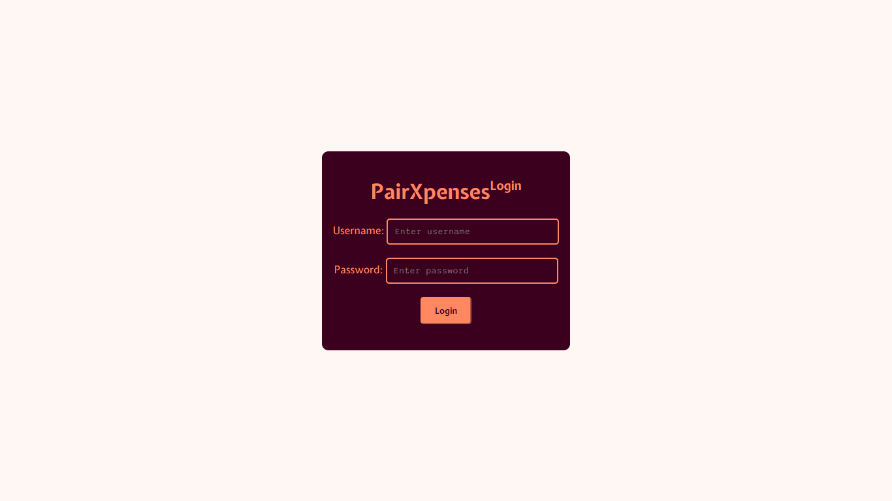
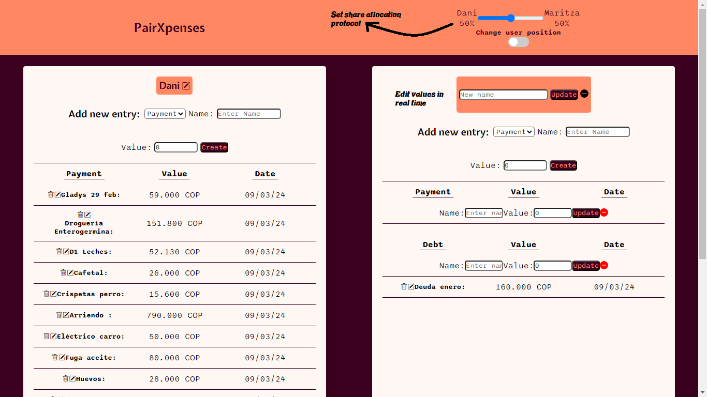
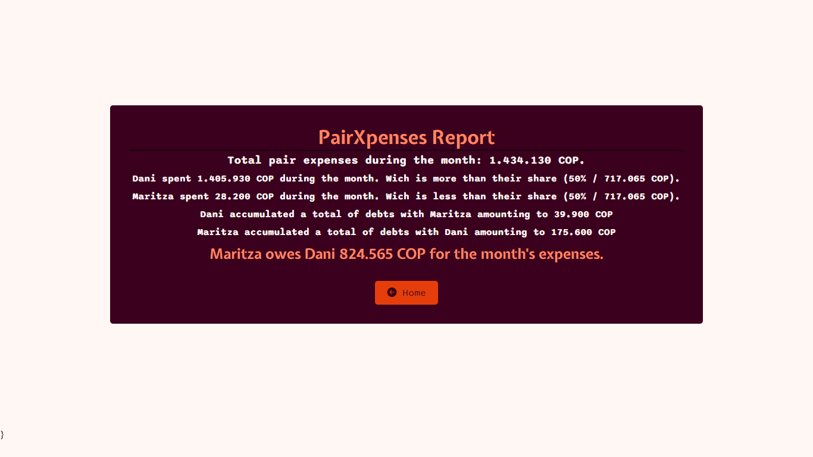

# PairXpenses Blazor - Frontend project for the Codigo facilito Bootcamp on web development with .NET.

## Table of Contents

- [Overview](#overview)
   - [Summary](#summary)

- [Author](#author)

## Overview

### Summary

Develop a Blazor app using Blazor for the full-stack application called PairXpenses. The application is designed to be used by couples (partners, roommates, or spouses) to keep track of expenses that the couple is supposed to make monthly on items such as rent, utilities, groceries, among others. As the daily dynamics of the mentioned couples unfold, it is highly likely that one of the members ends up making more payments than the other during the month. This application allows establishing a monthly expense allocation protocol: from the classic 50/50 split to any other proportion of expenses that each couple feels comfortable establishing according to their monthly incomes and personal agreements. With a simple click, the application provides a report of monthly expenses as well as which member of the couple owes the other to settle the month and start the accounting for the next one. In addition to payments, the app also allows users to record debts that one user has with the other. Debts are a separate entity because they are not intended to be shared expenses but rather payments that one member made for the other and commits to repay at the end of the month.

This app uses three main entities: User, Payment, and Debt. The application uses the PairXpenses API to retrieve payment and debt information between partners, according to the logged-in user. It allows real-time modification (CRUD) of each user's name in the application, creation of payments and debts for each user, as well as modification or deletion of existing payments and debts. The app offers the possibility to generate a final month-end report that establishes who owes whom based on the allocation protocol (which is set in the app UI) with a simple click of a button. Upon clicking, users are redirected to a report page that provides detailed information on all joint expenses for the month, individual expenses, debts, and final debt.

To run the app, you should use the command: `dotnet run` and wait for building.

## Screenshots

### Project Requirements (as stated by Codigo facilito):

- Implement Auth using JWT.
- Implement authorization.
- Data validation.
- Creation and reutilization of reactive components.
- Routes and navigation.
- CSS isolation.

#### Features

- Refresh in real time when an entity is modified.
- Implement authentication and authorization by using the JWT given by the API.
- Allow 2 different couples to use the API database with no interference of their data.
- The app is deployed on Azure to be used by the evaluators and by casual users. Here is the default user -> Username: codyone Password: codigofacilito123.

### Links

- Solution URL: [GitHub Repository](https://github.com/light-roast/PairXpensesFS)
- Azure URL: [Deployed on Azure](https://pairxpensesapp.azurewebsites.net/)

## Author

- Website: [Daniel Echeverri Llano](https://daniel-echeverri-portfolio.netlify.app/)
- Frontend Mentor: [@light-roast](https://www.frontendmentor.io/profile/light-roast)
